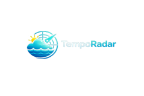
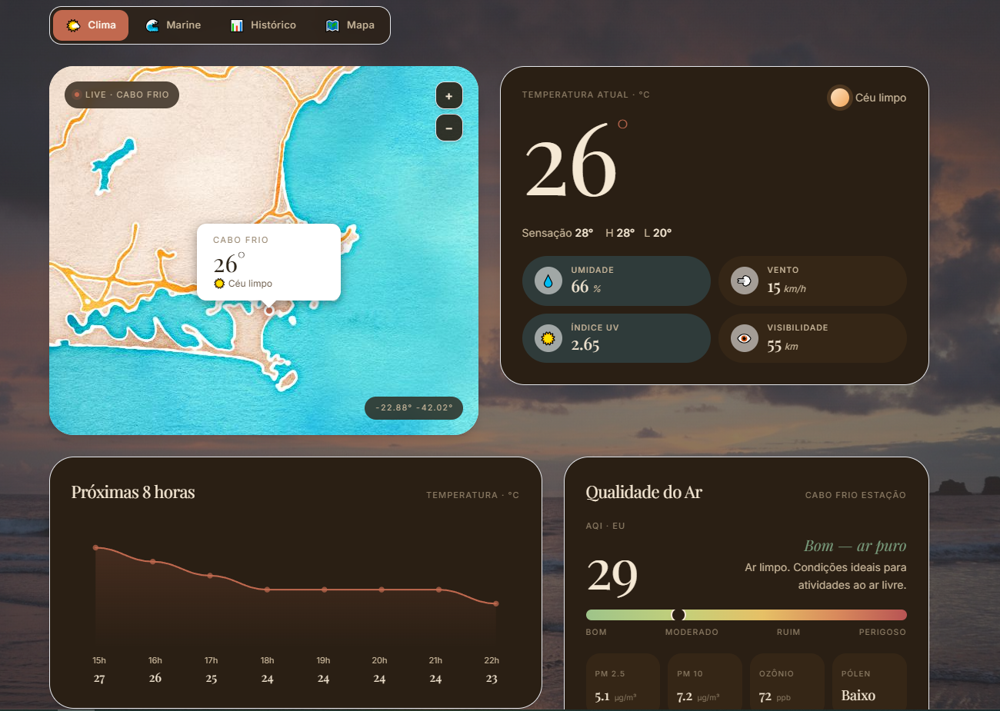
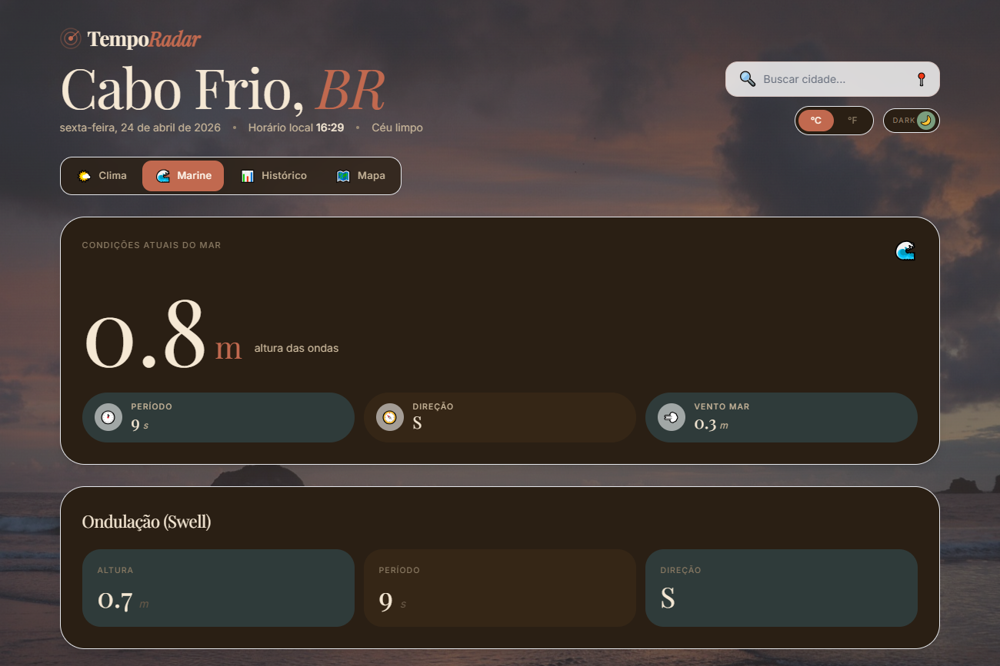
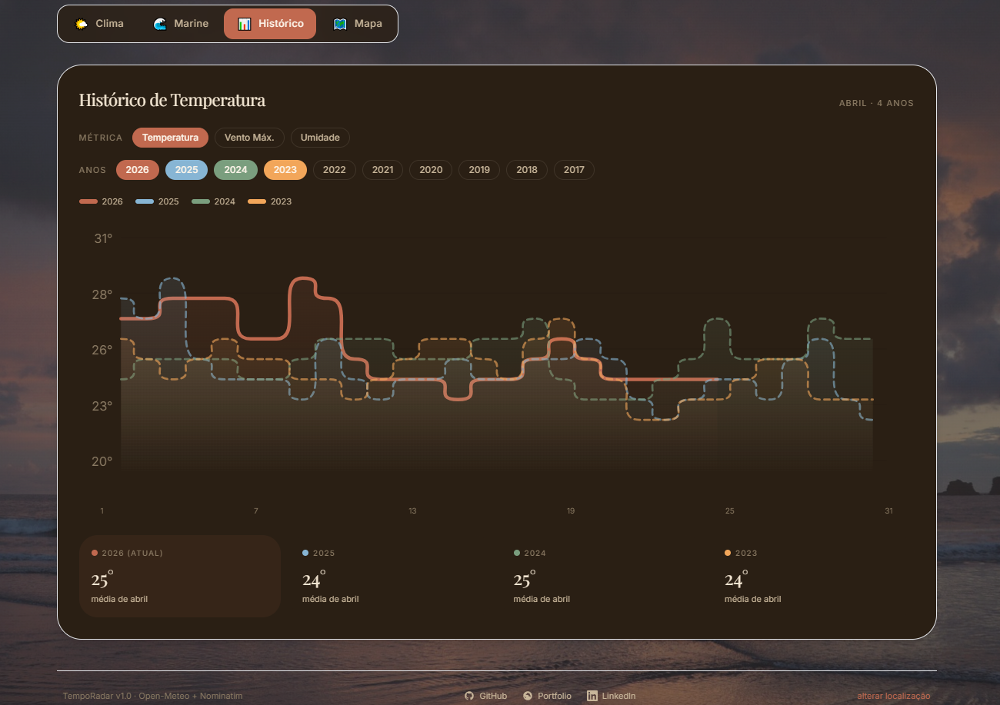
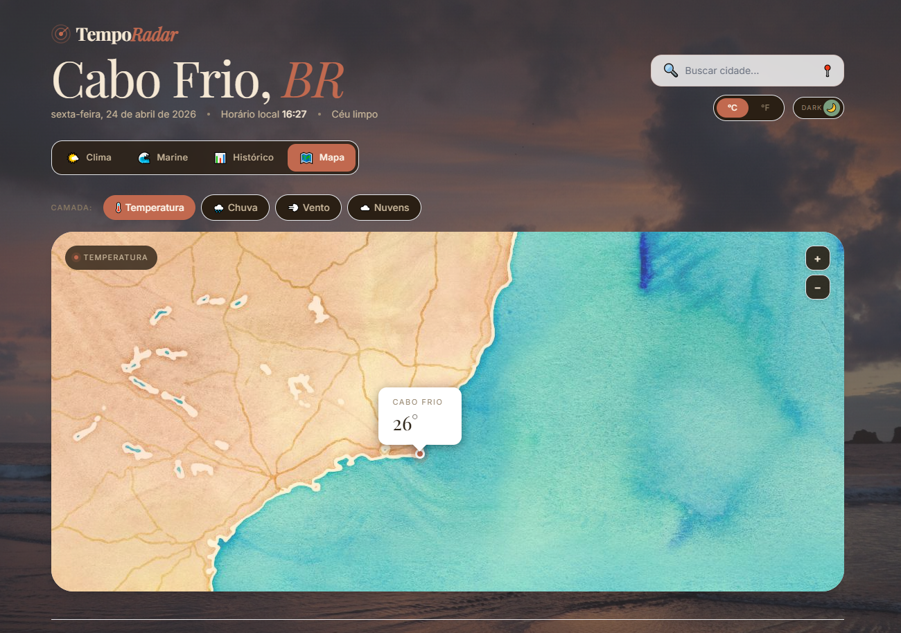

<div align="center">



**Aplicação de clima moderna com dados em tempo real, histórico comparativo e visualização de mapas meteorológicos.**


</div>

---

## ✨ Visão Geral

O **TempoRadar** é uma aplicação web de clima construída com Angular 17 standalone, Tailwind CSS v3 e múltiplas APIs abertas. O projeto exibe dados meteorológicos em tempo real com uma interface editorial refinada, suporte a dark/light mode com efeitos visuais exclusivos por tema, e ferramentas de análise histórica comparativa.

---

## 📸 Screenshots

### ☀️ Clima



### 🌊 Marine



### 📊 Histórico



### 🗺️ Mapa



---

## 🗂️ Funcionalidades

### Aba Clima

- Temperatura atual com sensação térmica, máxima e mínima
- Condições do tempo com ícone descritivo
- Umidade, vento, índice UV e visibilidade
- Mapa interativo com marcador da localização (Leaflet + Stadia Watercolor)
- Gráfico horário de temperatura
- Previsão de 7 dias

### Aba Marine

- Altura, período e direção das ondas em tempo real
- Dados de swell (ondulação)
- Gráfico de evolução das ondas com slider de janela temporal (6h–24h)

### Aba Histórico

- Gráfico comparativo de até 10 anos
- Seletor de anos com toggle individual e cache inteligente
- Seletor de métrica: Temperatura, Vento Máximo, Umidade
- Tooltip fluido no hover com data e valor
- Cards de média mensal por ano

### Aba Mapa

- Camadas meteorológicas via OWM Maps 1.0: Temperatura, Chuva, Vento, Nuvens
- Mapa base Stadia Watercolor
- Marcador interativo com popup de temperatura

### Recursos Globais

- Toggle °C / °F
- Dark / Light mode com persistência em localStorage
- Efeitos visuais por tema: raios de sol (light) e relâmpagos (dark) via Canvas
- Background temático com imagens fixas por modo
- Animações de entrada (zoom suave) ao trocar de aba
- Busca de cidades com autocomplete (Nominatim)
- Geolocalização automática via IP-API com fallback manual

---

## 🛠️ Stack

| Camada          | Tecnologia                         |
| --------------- | ---------------------------------- |
| Framework       | Angular 17 (Standalone Components) |
| Estilização     | Tailwind CSS v3                    |
| Linguagem       | TypeScript 5.x                     |
| Mapas           | Leaflet 1.x + Stadia Watercolor    |
| Gráficos        | SVG nativo                         |
| Clima           | Open-Meteo Forecast API            |
| Histórico       | Open-Meteo Archive API             |
| Marine          | Open-Meteo Marine API              |
| Geocoding       | Nominatim (OpenStreetMap)          |
| Geolocalização  | IP-API                             |
| Camadas de mapa | OpenWeatherMap Maps 1.0            |

---

## 🚀 Como Rodar Localmente

### Pré-requisitos

- Node.js 18+
- Angular CLI 17+

```bash
npm install -g @angular/cli
```

### Instalação

```bash
# Clone o repositório
git clone https://github.com/pecinallib/temporadar-web.git
cd temporadar-web

# Instale as dependências
npm install
```

### Variáveis de Ambiente

Crie o arquivo `src/environments/environment.ts`:

```typescript
export const environment = {
  production: false,
  owmApiKey: "SUA_CHAVE_OWM_AQUI",
};
```

> A chave OWM é necessária apenas para as camadas do mapa. As demais APIs (Open-Meteo, Nominatim, IP-API) são gratuitas e não requerem autenticação.

### Rodando

```bash
ng serve
```

Acesse `http://localhost:4200`

### Build de Produção

```bash
ng build --configuration=production
```

---

## 🗺️ Roadmap

- [ ] Deploy na Vercel
- [ ] Modo offline com Service Worker
- [ ] Alertas climáticos em tempo real
- [ ] Comparação entre duas cidades
- [ ] Responsividade mobile completa
- [ ] Suporte a PWA (instalável)
- [ ] Testes unitários (Jasmine/Jest)

---

## 🌐 APIs Utilizadas

| API                                                        | Uso                    | Custo    |
| ---------------------------------------------------------- | ---------------------- | -------- |
| [Open-Meteo Forecast](https://open-meteo.com)              | Clima atual e previsão | Gratuito |
| [Open-Meteo Archive](https://archive-api.open-meteo.com)   | Histórico até 1940     | Gratuito |
| [Open-Meteo Marine](https://marine-api.open-meteo.com)     | Ondas e swell          | Gratuito |
| [Nominatim](https://nominatim.org)                         | Geocoding e busca      | Gratuito |
| [IP-API](https://ip-api.com)                               | Geolocalização por IP  | Gratuito |
| [OWM Maps 1.0](https://openweathermap.org/api/weathermaps) | Camadas do mapa        | Freemium |

---

## 👤 Autor

Feito por **Matheus Pecinalli**

[](https://pecinalli-dev.vercel.app)
[](https://github.com/pecinallib)
[](https://linkedin.com/in/dev-pecinalli)

---

<div align="center">
  <sub>TempoRadar v1.0 · Open-Meteo + Nominatim · Angular 17</sub>
</div>
